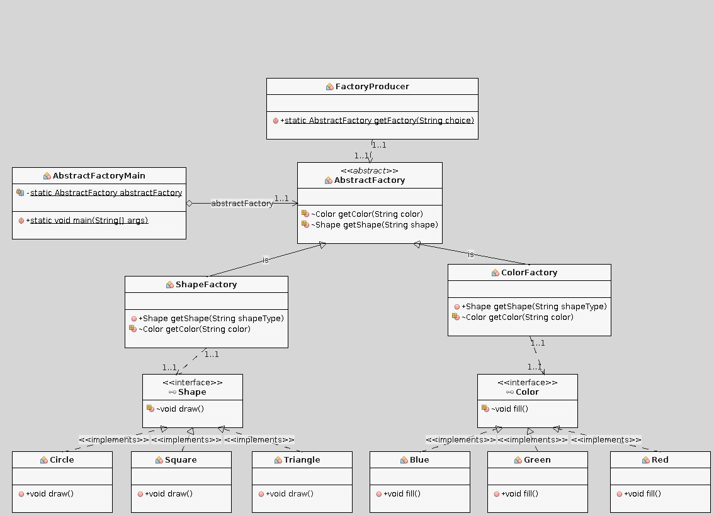

[indice](README.md)

Abstract Factory
----------------

- Permite la creacion de "familia" de objetos relacionados sin especificar las clases concretas.
- Provee una interfaz comun entre los objetos familiares.
- Usa Polimorfismo y composicion.

nota: Pueden volverse complejas.

> Un abstract Factory es una **Fabrica de fábricas**, que agrupa las dependencias entre si, sin especificar sus clases concretas.

Wikipedia:
> The abstract factory pattern provides a way to encapsulate a group of individual factories that have a common theme without specifying their concrete classes

## Casos de Uso ##
* Cuando existe codigo repetido en una clase y se busca crear o modificar dinamicamente subclases en tiempo real.
* Cuando una clase no puede saber la clase de objeto que debe crear.
* Cuando una clase desea que sus subclases especifiquen que objetos crean.

## Ejemplo ##

Se desea construir una figura y un color que respondan a las siguientes caracteristicas:

Figura:
* Puede ser un cuadrado.
* Puede ser un triangulo.
* Puede ser un circulo.

Color:
* Rojo
* Azul
* Verde

## Class Diagram ##


## Pasos ##

Crear la interfaz **Shape**. Esta definira que las clases que la implementen deben definir el metodo **draw**. Nota: Esta interfaz tambien puede ser una clase abstacta (patron factory method 2).

```
public interface Shape {
   void draw();
}
```
Creamos las clases **Circle**, **Square** y **Triangle** que implementen la interfaz (o los metodos abstractos de la clase abstracta).

  * Square

```
public class Square implements Shape {

   @Override
   public void draw() {
      System.out.println("Inside Square::draw() method.");
   }
}
```

  * Circle

```
public class Circle implements Shape {

   @Override
   public void draw() {
      System.out.println("Inside Circle::draw() method.");
   }
}
```

  * Triangle

```
public class Triangle implements Shape {

   @Override
   public void draw() {
      System.out.println("Inside Triangle::draw() method.");
   }
}
```

Repetimos el paso 1 2 y 3 para la Interfaz **Color** y las clases **Red**, **Green** y **Blue**

  * Color

```
public interface Color {
   void fill();
}
```

  * Red

```
public class Red implements Color {
   @Override
   public void fill() {
      System.out.println("Inside Red::fill() method.");
   }
}
```

  * Green

```
public class Green implements Color {
   @Override
   public void fill() {
      System.out.println("Inside Green::fill() method.");
   }
}
```

  * Blue

```
public class Blue implements Color {
   @Override
   public void fill() {
      System.out.println("Inside Blue::fill() method.");
   }
}
```

Creamos la clase abstracta AbstractFactory. Notese que su interfaz son 2 metodos **getColor** y **getShape**.
Esta clase abstracta nos proveera de los objetos **Color** y **Shape**

```
public abstract class AbstractFactory {
   abstract Color getColor(String color);
   abstract Shape getShape(String shape) ;
}
```

Creamos la Factory **ShapeFactory** la cual instancia las subclases **Circle**, **Square** o **Triangle** que implementan Shape acorde al parámetro **shapeType** (Este parámetro en vez de un String, tambien podria tambien implementarse con un enum de JAVA). Creamos la Factory **ColorFactory** la cual instancia las subclases **Red**, **Green** o **Blue** que implementan Color acorde al parámetro **colorType**

  * ShapeFactory

```
public class ShapeFactory extends AbstractFactory {

   @Override
   public Shape getShape(String shapeType){
      if(shapeType == null){
         return null;
      }
      if(shapeType.equalsIgnoreCase("CIRCLE")){
         return new Circle();
      }else if(shapeType.equalsIgnoreCase("TRIANGLE")){
         return new Triangle();
      }else if(shapeType.equalsIgnoreCase("SQUARE")){
         return new Square();
      }
      return null;
   }

   @Override
   Color getColor(String color) {
      return null;
   }
}
```

  * ColorFactory

```
public class ColorFactory extends AbstractFactory {
   @Override
   public Shape getShape(String shapeType){
      return null;
   }
   @Override
   Color getColor(String color) {
      if(color == null){
         return null;
      }
      if(color.equalsIgnoreCase("RED")){
         return new Red();
      }else if(color.equalsIgnoreCase("GREEN")){
         return new Green();
      }else if(color.equalsIgnoreCase("BLUE")){
         return new Blue();
      }
      return null;
   }
}
```

Creamos el generador de para obtener los distintos tipos de fabricas **Shape** o **Color**

```
public class FactoryProducer {
   public static AbstractFactory getFactory(String choice){
      if(choice.equalsIgnoreCase("SHAPE")){
         return new ShapeFactory();
      }else if(choice.equalsIgnoreCase("COLOR")){
         return new ColorFactory();
      }
      return null;
   }
}
```

Creamos la clase que ejecutamos (main method), el cual instacia la factory.
Primero llamamos al metodo **getShape** para obtener una instacia concreta de un objeto de tipo **Circle**, **Square** y **Triangle**.
Luego llamamos al metodo **getColor** para obtener una instancia concreta de un objeto de tipo **Red**, **Green** o **Blue**.

```
public class AbstractFactoryMain {
   private static AbstractFactory abstractFactory;

   public static void main(String[] args) {
      //get shape factory
      abstractFactory = FactoryProducer.getFactory("SHAPE");
      Shape shape1 = abstractFactory.getShape("CIRCLE");
      shape1.draw();

      Shape shape2 = abstractFactory.getShape("TRIANGLE");
      shape2.draw();

      Shape shape3 = abstractFactory.getShape("SQUARE");
      shape3.draw();

      //get color factory
      abstractFactory = FactoryProducer.getFactory("COLOR");
      Color color1 = abstractFactory.getColor("RED");
      color1.fill();

      Color color2 = abstractFactory.getColor("Green");
      color2.fill();

      Color color3 = abstractFactory.getColor("BLUE");
      color3.fill();
   }
}
```

Usos conocidos / ejemplos:

Las Abstract Factory son muy usadas para Dependency Injection (DI).
* Datasources (Drivermanager.class) / (Hibernate) / ADO .Net
* Interfaz al usuario,etc.

* JAVA
 * javax.xml.parsers.DocumentBuilderFactory#newInstance()
 * javax.xml.transform.TransformerFactory#newInstance()
 * javax.xml.xpath.XPathFactory#newInstance()

```
import javax.xml.parsers.DocumentBuilder;
import javax.xml.parsers.DocumentBuilderFactory;
import javax.xml.parsers.ParserConfigurationException;

public class DocumentBuilderFactoryDemo {
  public static void main(String[] args) {
       // set the provider for DocumentBuilder
       String provider ="com.sun.org.apache.xerces.internal.jaxp.DocumentBuilderFactoryImpl";

       // create a new DocumentBuilderFactory from an implementation
       DocumentBuilderFactory factory =DocumentBuilderFactory.newInstance(provider, null);
       try {
          // create a new DocumentBuilder
          DocumentBuilder builder = factory.newDocumentBuilder();
          // check the configuration for namespace aware
          System.out.println("" + builder.isNamespaceAware());
       } catch (ParserConfigurationException ex) {
          ex.printStackTrace();
       }
    }
 }
```

Spring framework

```
<bean name="ObjFactory" class="ObjFactory" />
<bean name="Circle" class="Circle" />
```
  * Circle

```
public class Circle {
 @Override
 public void draw() {
    System.out.println("Inside Circle::draw() method.");
 }
}
```

  * ObjFactory


```
public class ObjFactory implements ApplicationContextAware {
    private static ApplicationContext mApplicationContext;
    private static Map<String, String> processorBeanMap = new HashMap<String, String>();
    public static Circle getCircle() {
        String beanName = processorBeanMap.get();
        Circle bean = (Circle) mApplicationContext.getBean(beanName);
        return bean;
    }

    @Override
    public void setApplicationContext(ApplicationContext ac) throws BeansException {
        mApplicationContext = ac;
        Map<String, Circle> processorMap = mApplicationContext.getBeansOfType(Circle.class);
        if (processorMap.isEmpty()) {
            Error noProcessorError = new Error("No Circle configured. Check Spring Context");
            throw noProcessorError;
        }
        Set<Entry<String, Circle>> processorEntrySet = processorMap.entrySet();
        Iterator<Entry<String, Circle>> iterator = processorEntrySet.iterator();
        while (iterator.hasNext()) {
            Entry<String, Circle> entry = iterator.next();
            processorBeanMap.put(entry.getValue().getClass().getSimpleName(), entry.getKey());
        }
    }
}
```


Limitaciones:

* Las clases AbstractFactories deben declarar todos los metodos abstractos de todas las fábricas. Esto puede complejizar el código.
* Las clases que implementan las fábricas deben retornar null para aquellos métodos de fabricas a las que no pertenecen.

Ventajas:

* El patron se usa cuando existen clases polimórficas que tienen instanciaciónes diferentes y se desea que algún módulo cree instancias y las use, sin conocer los detalles de la instanciación de objetos.
* En ausencia del patron Abstract Factory, el Cliente necesita conocer detalles de clases concretas. Este tight coupling puede ser eliminado si se usa el patrón.
* Permite realizar Inversión de Control (IoC) fácilmente
* Hace su código más testeable al poder mockear interfaces.
* Incrementa la flexibilidad cuando llega el momento de cambiar la aplicación (es decir, puedes crear nuevas implementaciones sin cambiar el código dependiente)


Bibliografia

[Head First Design Patterns](http://shop.oreilly.com/product/9780596007126.do)

[Gang Of Four - Design Patterns, Elements Of Reusable Object Oriented Software](https://www.amazon.co.uk/Design-patterns-elements-reusable-object-oriented-x/dp/0201633612)

[JAVA Desing Patterns](http://www.apress.com/us/book/9781484218013)
[iluwatar git](https://github.com/iluwatar/java-design-patterns/tree/master/factory-method)

[kamranahmedse git](https://github.com/kamranahmedse/design-patterns-for-humans/blob/master/README.md#-factory-method)

[TutorialsPoint](https://www.tutorialspoint.com/design_pattern/factory_pattern.htm)

[UAI]()

[stackoverflow](https://stackoverflow.com/questions/2280170/why-do-we-need-abstract-factory-design-pattern)
