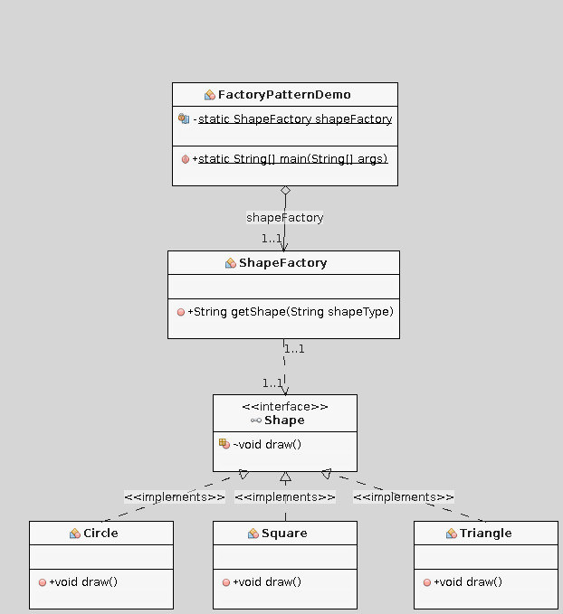

[indice](README.md)

# Factory Method #
--------------

## Definicion ##

**Permite la creacion de objetos sin exponer la logica de instanciación al cliente pudiendo acceder a dichos usando una interfaz comun**.

> Provee una forma de delegar la logica de instanciación a las subclases.

Wikipedia:
> In class-based programming, the factory method pattern is a creational pattern that uses factory methods to deal with the problem of creating objects **without having to specify the exact class of the object that will be created**. This is done by creating objects by calling a **factory method** —either specified in an interface and implemented by child classes, or implemented in a **base class and optionally overridden by derived classes—rather** than by calling a constructor.

## Casos de Uso ##

* Cuando existe codigo repetido en una clase y se busca crear dinamicamente subclases en tiempo real.
* Cuando una clase no puede saber la clase de objeto que debe crear.
* Cuando una clase desea que sus subclases especifiquen que objetos crean.

## Ejemplo ##

Se desea construir una figura que responda a las siguientes caracteristicas:
* Puede ser un cuadrado.
* Puede ser un triangulo.
* Puede ser un circulo.

## Class Diagram ##



## Pasos ##

1. Crear la interfaz **Shape**. Esta definira que las clases que la implementen deben definir el metodo **draw**.

Nota: Esta interfaz tambien puede ser una clase abstacta (patron factory method 2).

```
public interface Shape {
   void draw();
}
```

2. Creamos las clases **Circle**, **Square** y **Triangle** que implementen la interfaz (o los metodos abstractos de la clase abstracta).

  * Square
```
public class Square implements Shape {

   @Override
   public void draw() {
      System.out.println("Inside Square::draw() method.");
   }
}
```

* Circle
```
public class Circle implements Shape {

   @Override
   public void draw() {
      System.out.println("Inside Circle::draw() method.");
   }
}
```

* Triangle
```
public class Triangle implements Shape {

   @Override
   public void draw() {
      System.out.println("Inside Triangle::draw() method.");
   }
}
```

3. Creamos la Factory **ShapeFactory** la cual instanciara las subclases **Circle**, **Square** o **Triangle** que implemetan Shape acorde al parámetro **shapeType**. Este parámetro en vez de un String, tambien podria tambien implementarse con un enum de JAVA.

```
public class ShapeFactory {

   //use getShape method to get object of type shape
   public Shape getShape(String shapeType){
      if(shapeType == null){
         return null;
      }
      if(shapeType.equalsIgnoreCase("CIRCLE")){
         return new Circle();

      } else if(shapeType.equalsIgnoreCase("TRIANGLE")){
         return new Triangle();

      } else if(shapeType.equalsIgnoreCase("SQUARE")){
         return new Square();
      }

      return null;
   }

}
```
Ej con enum:
```
public enum ShapeType {

  CIRCLE("CIRCLE"), TRIANGLE("TRIANGLE"), SQUARE("SQUARE"), UNDEFINED("");

  private final String tipo;

  ShapeType(String title) {
    this.tipo = title;
  }

  @Override
  public String toString() {
    return tipo;
  }
}
```

4. Creamos la clase que ejecutamos (main method), el cual instacia la factory y luego llama al metodo **getShape** para obtener una instacia concreta de un objeto de tipo **Circle**, **Square** y **Triangle**.
```
public class FactoryPatternMain {

   private static ShapeFactory shapeFactory;

   public static void main(String[] args) {
       shapeFactory = new ShapeFactory();

      //Obtiene una instancia de la clase Circle.
      Shape shape1 = shapeFactory.getShape("CIRCLE");
      shape1.draw();

      //Obtiene una instancia de la clase Triangle.
      Shape shape2 = shapeFactory.getShape("TRIANGLE");
      shape2.draw();

      //Obtiene una instancia de la clase Square.
      Shape shape3 = shapeFactory.getShape("SQUARE");
      shape3.draw();
   }
}
```

Usos conocidos del factory Method:

* java.util.Calendar
* java.util.ResourceBundle
* java.text.NumberFormatCredits
* java.nio.charset.Charset
* java.net.URLStreamHandlerFactory
* java.util.EnumSet
* javax.xml.bind.JAXBContext

Credits
[iluwatar git](https://github.com/iluwatar/java-design-patterns/tree/master/factory-method)
[kamranahmedse git](https://github.com/kamranahmedse/design-patterns-for-humans/blob/master/README.md#-factory-method)
[TutorialsPoint](https://www.tutorialspoint.com/design_pattern/factory_pattern.htm)
[UAI]()

Patrón Abstract Factory

Motivación
Aplicabilidad
Estructura, colaboraciones
Consecuencias
Con ejemplo en Java.
Mencionar como en Spring los factories se usan para desacoplar los hotspots de las clases que los implementan.
Informe:

 - Rol de los patrones creacionales en los frameworks. Ejemplos. 
